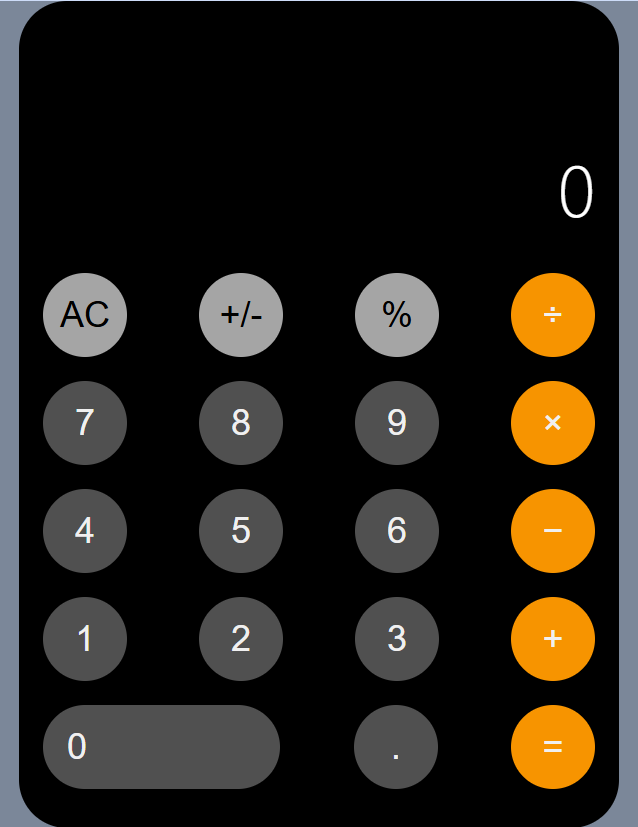

# 🧮 Responsive Web Calculator

A **responsive, mobile-friendly calculator** built with **HTML, CSS, and Vanilla JavaScript**, inspired by the iOS calculator.  
It includes all basic math operations, percentages, negation, repeated `=` handling, and a polished UI.

---

## 🚀 Features

- **Responsive Design**
  - Scales beautifully on desktop, tablet, and mobile using `flexbox` and `clamp()` for sizing.
- **Interactive Buttons**
  - Smooth hover and press animations.
  - Pill-shaped `0` button and circular buttons for numbers/operators.
- **Math Operations**
  - Addition `+`, Subtraction `−`, Multiplication `×`, Division `÷`.
- **Extra Operations**
  - **AC (reset)** clears all.
  - **+/-** toggles negative numbers.
  - **%** calculates percentage relative to the previous number.
  - **Repeated `=`** re-applies the last operation.
  - **Chaining actions** allows applying multiple operations sequentially.
- **Smart Display**
  - Auto font-size reduction for long numbers.
  - Converts very long or tiny numbers to scientific notation.
  - Handles division by zero (`Error`) and infinity overflow (`Overflow`).

---

## 📂 Project Structure

Responsive_Calculator/ <br>
├── index.html # Calculator UI and structure <br>
├── style.css # Styling and responsive design <br>
├── Calculator.js # JavaScript logic for operations and display <br>
└── README.md # Project documentation <br>


---

## 📖 Usage

### 1. Clone the repository:

```bash
git clone https://github.com/<your-username>/<repo-name>.git
```

### 2. Open the project folder and launch index.html in any modern web browser.

### 3. Start calculating!

### 🛠️ Technologies <br>
HTML5 – Semantic structure for calculator layout

CSS3 – Flexbox, responsive units (clamp), hover effects

JavaScript (ES6) – Handles all button logic and display updates

### 🎯 Planned Improvements <br>
Keyboard Support: Type numbers and operators directly.

Calculation History: Show past calculations in a side panel.

Theme Toggle: Light and dark modes.

Audio Feedback: Optional click sounds on button press.

### 📸 Preview <br>



👤 Author <br>
Ori Berger